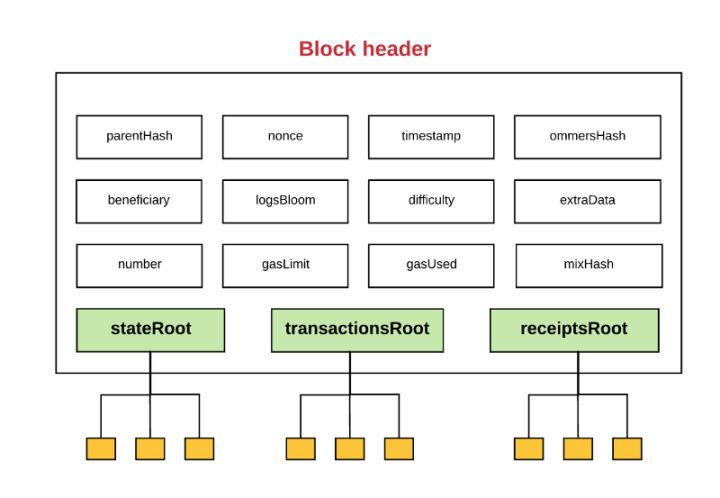
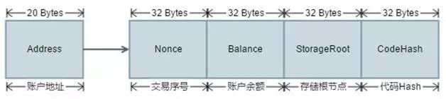
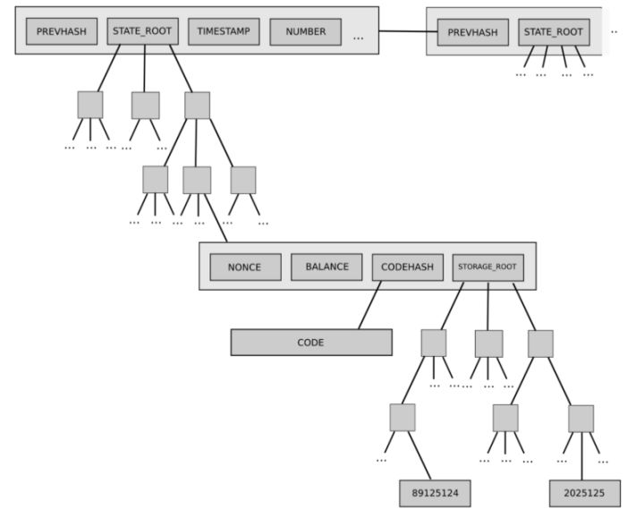
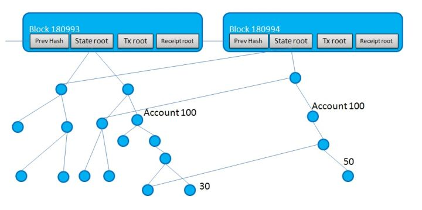

#以太坊的数据结构
以太坊中有两种不同的数据类型：永久数据和暂时数据。永久数据的例子就是转账。一旦转账确认，就会在区块链中记录；然后就再也不可以更改。暂时数据的例子就是特定以太坊账户地址的余额。账户的余额就会存储在状态树中，并且当有特定账户转账的时候，就会改变。永久数据是有意义的，就好像挖矿转账，暂时数据，就例如账户余额，应该被分开存储。以太坊会使用数据树结构来管理数据。

每个块包含块头和交易，其中块头的结构如下图所示
```json
{
  difficulty: 131072,
  extraData: "0xd88301080d846765746888676f312e31302e31856c696e7578",
  gasLimit: 4122287823,
  gasUsed: 21000,
  hash: "0xb228db718b04306b80cb2fa61612dd8d668732f4dd9fa81fab2c09aac79057af",
  logsBloom: "0x00000000000000000000000000000000000000000000000000000000000000000000000000000000000000000000000000000000000000000000000000000000000000000000000000000000000000000000000000000000000000000000000000000000000000000000000000000000000000000000000000000000000000000000000000000000000000000000000000000000000000000000000000000000000000000000000000000000000000000000000000000000000000000000000000000000000000000000000000000000000000000000000000000000000000000000000000000000000000000000000000000000000000000000000000000000",
  miner: "0x75479677a6b14b97c8be38e2edbdec2295bb65a5",
  mixHash: "0xad8350fd5b661351ee986aec5b2837cd646c7ad7cc216296bff31ebdfc657d28",
  nonce: "0x7b8b6213e00740dd",
  number: 42,
  parentHash: "0x3eedc7bf00510ab4e4060ddef58600e2c63de4d36b41fa5799f00cafb0e1ee55",
  receiptsRoot: "0xf28076e353dc8dbb2b1a6d7212e41fd8231ff4caf28fb565aafe57710185cf71",
  sha3Uncles: "0x1dcc4de8dec75d7aab85b567b6ccd41ad312451b948a7413f0a142fd40d49347",
  size: 651,
  stateRoot: "0x47e3dee844220cd2cd91ca56bfe441962d3712c0d66890a200e91087fb09a8ef",
  timestamp: 1534830115,
  totalDifficulty: 5543424,
  transactions: ["0x23a9cb76ef8e3202b5e0e7aa1cc2a6d42813ceab4eea442a54f5fa657ddddd00"],
  transactionsRoot: "0xf9150d978ac1baea776bcc1cb9505ed97be7b575aa90b9f91a6662bd42a06aa5",
  uncles: []
}
```
交易的信息：
```json
{
  blockHash: "0xb228db718b04306b80cb2fa61612dd8d668732f4dd9fa81fab2c09aac79057af",
  blockNumber: 42,
  from: "0x75479677a6b14b97c8be38e2edbdec2295bb65a5",
  gas: 90000,
  gasPrice: 18000000000,
  hash: "0x23a9cb76ef8e3202b5e0e7aa1cc2a6d42813ceab4eea442a54f5fa657ddddd00",
  input: "0x",
  nonce: 2,
  r: "0xfd189f326ca1e0bee213167bd96cc0fd9e4c1035134fc5c8dc1f5abebecc3db6",
  s: "0x22819dd10fd3d03f1e1e25b2b0002ed6201f85061ef9e3b07919d697563475ed",
  to: "0x11f573575f5e85fb03204883fdaf41be51bed1e6",
  transactionIndex: 0,
  v: "0x4d",
  value: 10000000000000000000
}
```

几个关键字段的含义如下：

- ParentHash:父块的哈希值
- Number:块编号
- Timestamp:块产生的时间戳
- GasUsed:交易消耗的Gas
- GasLimit:Gas限制
- Difficulty:POW的难度值
- Beneficiary：块打包手续费的受益人，也称矿工
- Nonce：一个随机数，使得块头哈希满足POW需求,账户发起交易需要花费一些gas，作为手续费归矿工所占有。在POW模式下，矿工在打包块的时候，需要不停的调整Nonce，使得整个块头的哈希值满足一定的条件（比如头几位都是0）
- StateRoot：状态树的根哈希值
- TransactionsRoot：交易树的根哈希值
- ReceiptsRoot：收据树的根哈希值

每个矿工在把交易打包成块的时候，会组织三颗树：
交易树，树叶里是交易
收据树，树叶里是交易生成的收据
状态树，树叶里是交易影响到的账户状态

**三棵树求取根哈希，可以得到 区块头中的StateRoot,TransactionsRoot,ReceiptsRoot三个字段。这样就建立了交易和区块头字段的映射。当其他用户收到块，根据块里的交易可以计算出收据和状态，计算三个根哈希后和区块头的三个字段进行验证，判断这是否为合法的块。**

## 状态
在上文中我们提到，以太坊是基于状态的。多个账户的状态共同组成了以太坊的全局状态。账户分为两种：
- 外部账户(Externally owned account)，被私钥控制且没有任何代码与之关联。一个外部账户可以创建交易，来发送消息给另一个外部账户或合约账户，以此来触发转账交易和智能合约的调用、创建
- 合约账户(Contract account)，被它们的合约代码控制且有代码与之关联。合约账户不可以自己发起一个交易，只能被外部账户调用。


每个账户包含了以下的字段：
- Address：账户地址，与用户私钥唯一对应的一组20字节的数据串。
- Balance：该账户的余额
- Nonce：该账户为外部账户时候，表示该账户创建的交易序号,每做一次交易都会加1。该账户为合约账户时候，表示该账户创建的合约序号，每创建一次会加1。
- CodeHash：该账户为合约账户时候，表示合约的哈希值，否则为空字符串的哈希
- StorageRoot：该账户的存储内容组成Merkle树后求得的根哈希值

**任何一个以太坊的账户都可以基于其地址在以太坊的数据库中按照MPT树的检索规则找到对应的一条账户存储记录。检索的Key值为账户地址的hash值，检索到的Value值是上述结构的一个RLP编码数据串，可以基于RLP的编码规则逆向解析出其对应的属性值。**

以太坊用NoSQL数据库以Key-Value的形式存储所有的数据。针对账户数据结构，需要存储的数据主要包含智能合约的Storage和基本的账户信息。对应的存储规则如下：
1. 针对智能合约Storage，将数据按照编码规则映射成MPT，然后将MPT的所有节点的Key和Value构建一个RLP List编码作为数据库存储的Value值，将该Value值进行Sha3计算hash值作为数据库存储的Key值进行存储。
2. 针对基本账户信息，将其对应智能合约Storage的MPT Root Hash保存于账户的StorageRoot属性，然后将系统中的所有Account构建一个MPT。按照和Storage的数据库存储方式将MPT的所有节点进行存储。



**多个块的MPT树共享了账户状态，子块状态树和父块状态树的差别在于它指向了在子区块中被改变了的账户。这样节省了总的存储空间，方便了块的回滚操作。**


每个区块对应一个以太坊的状态，多个区块连起来就相当于以太坊的多个状态

## 交易(Transaction)
外部账户可以创建交易,用自己的私钥进行签名之发送消息给另一个外部账户或合约账户。两个外部账户之间传送的消息即为转账操作。从外部账户到合约账户的消息会激活合约账户的代码，执行各种操作，也就是我们常说的调用智能合约。可以通过向0地址发起交易来创建合约账户。交易包含以下主要字段：

- Type：交易的类型，ContractCreation（创建合约）还是MessageCall（调用合约或转账）
- Nonce: 发送地址的交易计数
- Value: 向目标账户发送的金额
- ReceiveAddress：接受方地址
- GasPrice:为交易付出的Gas价格
- Gas:为交易付出的Gas
- Data：交易的附加数据
- VRS:交易签名结构体

## 收据(Receipt)
账户创建交易并向其它节点广播后，会被其它节点执行并放入准备打包的区块。在这个过程中会生成一个收据。收据的主要字段有：

- blockHash: 交易所在块的哈希值
- blockNumber: 交易在块的序号
- transactionHash: 交易的哈希值
- transactionIndex: 交易在块中的序号
- from: 发送者地址
- to: 接受者地址，为空时候表示创建合约
- cumulativeGasUsed: 执行完此交易时候，块内消耗的总的gas值
- gasUsed:本交易所消耗的gas
- contractAddress: 当此交易为创建合约时，表示所创建合约的地址，否则为空
- logs: 此交易的日志

**需要注意的是，在不同的节点之间并不会发送状态和收据，后两者在可以通过交易计算得到。**

参考：
[以太坊介绍（一）：以太坊的数据结构](https://zhuanlan.zhihu.com/p/30922425)<br>
[深入了解以太坊：数据到底是如何存储在以太坊网络的](https://minerbbs.com/1376.html)<br>
[来自10年经验的大咖对以太坊数据存储的思考与解读](http://www.blockchainbrother.com/article/805)
