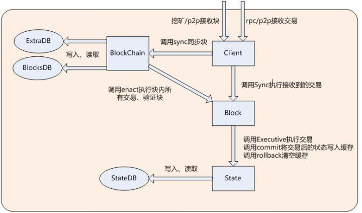
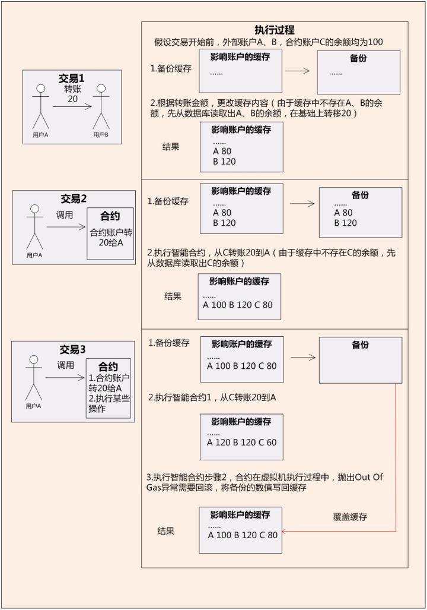
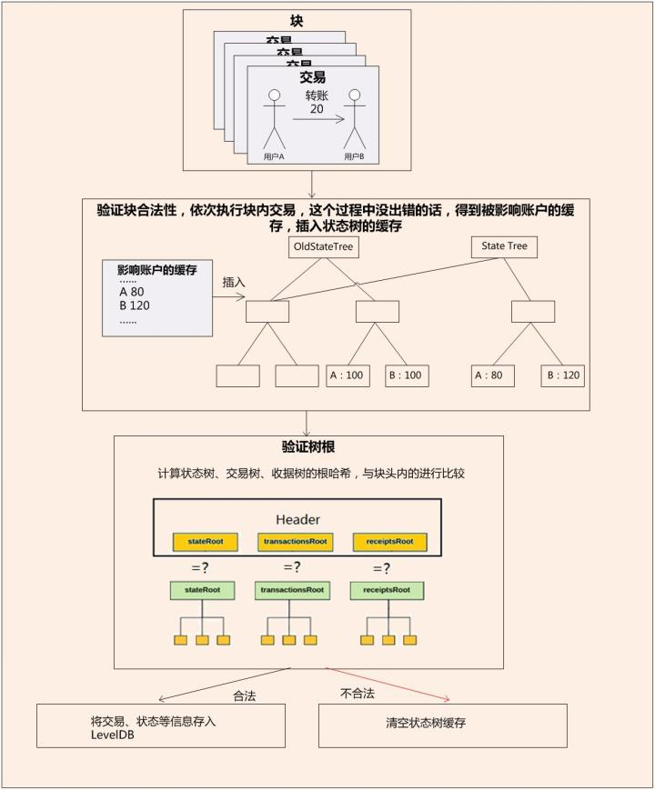

#以太坊数据的存储和更新

##引言
在第一篇文章里我们从静态的角度讲解了以太坊的数据的组织形式。这一篇文章里，我们从动态的角度出发，以cpp-ethereum v130为例分析以太坊全节点中，区块链数据在各个环节是怎么加载、更新、回滚、保存。

- 进行相关操作的类主要包括以下几个：
    - BlockChain:区块链数据的类
    - Block:块数据类
    - BlockHeader:块头信息类
    - State:状态信息的类，每个Block实例包含一个State成员变量
    - Client:类响应RPC调用，管理交易、块的接受和处理

- 以太坊采用LevelDB作为底层数据库，它是一个google实现的非常高效的kv数据库。key和value均为任意长度的字节数组。数据库提供了基本的接口操作包括Put()、Delete()、Get()、Batch()，支持批量操作的原子性。
- 编码方式采用了RLP，RLP(Recursive Length Prefix，递归长度前缀)是一种编码算法，用于编码任意的嵌套结构的二进制数据，它是以太坊中数据序列化/反序列化的主要方法，区块、交易等数据结构在持久化时会先经过RLP编码后再存储到数据库中。 下面介绍主要的数据存储和操作流程

## 数据读取
BlockChain和Client类在初始化时候，总计会打开三个LevelDB的数据库连接：
- blocksDB:保存了块的主体内容，包括块头和交易。
- stateDB:保存了账户的状态数据。
- extraDB:保存了收据信息和其它辅助信息。
客户端运行过程中可能需要加载块数据或者读取账户信息。具体过程如下：

###从数据库加载块数据
Client类初始化时候，并不会把所有的块数据加载到内存中，而是在运行过程中按需加载。当需要根据块号去生成对应块时候，流程如下：
1. 从extraDB里，以块号为key读取到块哈希值
2. 调用Block类的提供了一个同步方法(sync(BlockChain,h256))，以块哈希为key，读取到rlp编码后的区块数据。在这个过程中，会对查询结果进行缓存，这样第二次便不必去数据库里读取。
3. 解码区块数据，按照设定的规则可以依次读取父块哈希、叔块哈希、作者地址、状态树根哈希、交易树根哈希、收据树根哈希、块内交易等各种内容，以此来填充Block对应字段。

###从数据库读取账户信息
- 账户信息包括该地址对应的余额、存储、Nonce和字节码的哈希值。为了读取某个块下的账户信息，我们首先要执行上一步，取得区块中的状态根哈希。
- 这颗MPT状态树与普通树的一个区别是：父节点保存了子节点的哈希值，而非指向子节点的指针。每个节点的哈希值为key，节点内容rlp编码后的字符串为value，通过stateDB保存到了LevelDB里。这样整个树都保存在了本地数据库中。
- 我们根据块中的树根哈希，在树中查找到编码后的账户信息，解析得到需要的字段。

## 区块链数据更新与回滚

###交易数据
- Client类可以自己创建或者从p2p网络接收到各种交易。这些交易在验证之后，会在未被确认的块中（也就是pending块）进行插入、执行和打包。Client类创建了m_preSeal，m_postSeal，m_working三个块，在多线程的条件下合作完成这个流程。后面会有专门篇幅来讲解。我们这里关注数据的更新。
- State类里有两个关键的成员变量： 1.m_state 维护了上面提到的MPT树，支持树的各种插入更新操作。并支持在数据真正向数据库提交前的缓存 2.m_cache 通过两个unordered_map(支持不同key)提供了key-value缓存功能，用于缓存交易改变的账户数据
- 当交易被插入块中，首先会被存储在块实例的一个Vector容器里。在这些交易执行时候，会影响到一些账户的状态，这些新值首先会被写入State实例的成员变量m_cache里。在执行一个可能发生回滚的交易前，m_cache会被复制一份。假如交易需要回滚，那么m_cache会被重新赋值回去，然后执行下一个交易。
- 所有的交易被执行过，可以正常打包。那么m_cache里的内容会被State的commit函数插入到m_state这个成员变量的缓存中。每次插入状态树可以计算一个根哈希值，而所有的交易都执行过之后交易树和收据树也可以计算出根哈希，这就是前边提到的区块头的三个字段。

###块数据
- 当本地客户端成功的挖出一个块，或者通过p2p网络收到其它客户端发来的块后。本地客户端会再次执行块内所有的交易，所有交易执行成功后，和上面提到的一样，被影响的数据会被从m_cache插入到到m_state中的缓存。
- 接下来会进行父哈希、Gas等多种验证，任何一项不通过的话，都会触发m_state清空缓存。

###区块链数据保存
- 在上面的环节中，如果块数据最终通过了验证，是一个有效的块。BlockChain会调用m_state中db的commit操作，将缓存的状态通过写入本地数据库。
- 然后把块数据通过blocksDB写入本地数据库。
- 最后把收据、最新区块号等信息通过extraDB写入本地数据库。这样区块链数据就被保存到了本地。
